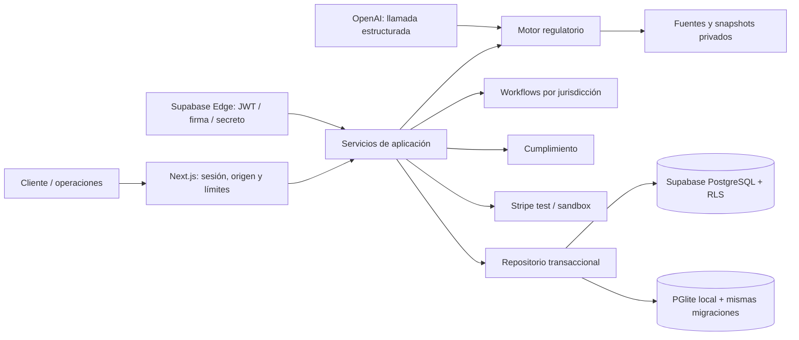

# Arquitectura

Next.js App Router y React presentan la experiencia pública, el espacio del cliente y la operación interna. TypeScript estricto y Zod validan las entradas. El CSS usa tokens propios, diseño adaptable y componentes accesibles; las decisiones de regulación no viven en componentes React.

## Fronteras

- `packages/domain`: tipos, entradas y permisos.
- `regulatory-engine`: URL oficial exacta, captura, normalización, hashes, vigencia, evidencias y publicación.
- `jurisdiction-engine` + `jurisdictions`: recomendación explicable y cuatro rutas. El catálogo de presentación es independiente del motor del servidor.
- `workflow-engine`: pasos ordenados, responsables, pago, identidad, firmas y registro. La revisión y los partners no se convierten en automatización implícita.
- `application`: casos, órdenes, eventos, compañías, períodos y alertas, con control de pertenencia antes de cada escritura.
- `compliance-engine`: funciones de fechas, importes y recordatorios derivadas de versiones verificadas.
- `document-engine`: formatos permitidos, contenido activo, cuarentena, hashes y enlaces breves.
- `billing` e `integrations`: límites explícitos SANDBOX / STRIPE_TEST / EXTERNAL_BLOCKED.
- `ai`: el modelo puede solicitar una herramienta. La respuesta factual la genera el motor, no texto libre del modelo.
- `edge`: los mismos servicios detrás de diez handlers Supabase. `scripts/build-edge.mjs` empaqueta código compartido, con dependencias npm fijadas en `deno.json`.

## Consistencia

Las mutaciones de varias tablas pasan por `apply_operations`, una RPC exclusiva de service_role. Valida tablas/columnas y usa una transacción. Las revisiones de workflow y estados de pago actúan como precondiciones; una escritura concurrente falla y revierte el conjunto. Los IDs externos y las claves únicas evitan pagos, compañías, períodos y notificaciones duplicados. Un timeout se reintenta con la misma clave, nunca con una orden nueva.

La web usa cookies HttpOnly y Supabase SSR en modo conectado. Las funciones Edge validan JWT mediante `auth.getUser`; los roles se leen de tablas, no de metadatos enviados por el cliente. La RPC privilegiada nunca se entrega al navegador. Las lecturas web usan un cliente sujeto a RLS; los servicios privilegiados verifican el alcance de cada operación.

## Límites del MVP

No hay ejecución gubernamental real, aceptación bancaria, screening de sanciones operativo ni firma regulada. La aprobación de archivos es manual, no un antivirus completo. El correo externo está bloqueado y los recordatorios comprobados son internos. Las consultas están limitadas a 1000 filas; paginación, colas de gran volumen y SLO de producción requieren trabajo antes de escalar.

El modo local no replica el gateway, GoTrue ni Storage de Supabase. Prueba SQL/RLS con PostgreSQL real embebido; la validación integral Supabase está definida en CI y pendiente de ejecución en un entorno con Docker.
